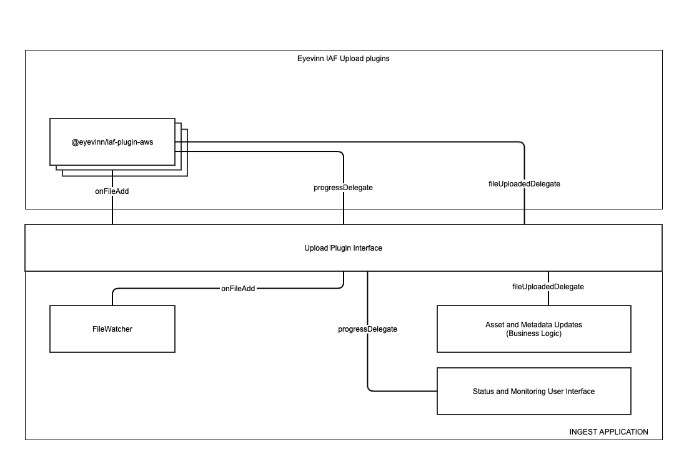

The Eyevinn Ingest Application Framework (Eyevinn IAF) is a framework to simplify building VOD ingest applications. A framework of open source plugins to integrate with various transcoding and streaming providers. 

## Overview
The Figure below shows the intended way to use IAF plugins with an ingest application. The Eyevinn IAF upload plugins handle service-specific integrations. This approach makes integration with different providers simpler.

## Available Plugins

- [@eyevinn/iaf-plugin-aws](https://www.npmjs.com/package/@eyevinn/iaf-plugin-aws) for transcoding using AWS MediaConvert.
- [@eyevinn/iaf-plugin-aws-mediapackage](https://www.npmjs.com/package/@eyevinn/iaf-plugin-aws-mediapackage) for just-in-time video packaging of files using AWS MediaPackage.
- [@eyevinn/iaf-plugin-aws-s3](https://www.npmjs.com/package/@eyevinn/iaf-plugin-aws-s3) for uploading to an S3 bucket.
- [@eyevinn/iaf-plugin-encore-local](https://www.npmjs.com/package/@eyevinn/iaf-plugin-encore-local) for transcoding using SVT Encore video transcoding tool.

## Building your own plugin

If you want to write you own IAF plugin for your transcoding service of choice, your module will need to implement one of the interfaces defined in `interfaces.d.ts`.

The interfaces are purposefully barebones, in order to make integrations with many different services possible.

If your plugin interacts with a transcoding service, it should implement the `IafUploadModule` interface. If your plugin watches for new ingest files, it should implement the `IafFileWatchModule` interface. Both interfaces require the injection of a `Logger` object.

### `IafUploadModule`

As the name implies, this interface is for IAF modules that upload ingest files to a specific transcoding service, and dispatches a transcoding job for the file in question. The actual implementation may vary between modules, as different services have differing APIs.
The public methods are:

#### `onFileAdd(filePath: string, readStream: Readable, contentType?: string)`

This method should be attached to the file watcher being used, as shown in the figure at the start of the readme.
It is meant to run when a file is added to the ingest destination.

##### Parameters

`filePath`: the full path to the added file. This can be used to (for example) get the file name.

`readStream`: a `Readable`stream of the file to upload. Files need to be provided as streams in order keep memory consumption at a reasonable level.

#### `progressDelegate: (result: any) => any`

A function that should be injected when constructing an UploadModule instance. This callback should be called whenever the upload progresses. Possible uses are logging and error handling.

#### `fileUploadedDelegate: (result: any, error?: any) => any`

A callback function that should be injected when instantiating an upload module. The callback is run when the UploadModule has finished uploading the file to the associated transcoding service.

Apart from implementing the public methods, we strongly encourage implementing all attributes as well, as we believe that they are necessary for well-functioning implementation of the IAF.

### `IafFileWatchModule`

This interface is for IAF modules that watch an ingest destination for file additions. This could in theory be a local folder, a mounted NAS, or some cloud storage service (depending on the available SDK capabilities).
It has one public method:

#### `onAdd(callback: (filePath: string, readStream: Readable, contentType?: string))`

This method take one parameter, a callback function that in turn takes three parameters: the path to a newly added file, a `Readable` stream of said file and the content type of the file.
Keen readers may notice that the callback has the same interface as the `onFileAdd` method in the `IafUploadModule` class. The idea is that the filewatcher executes the provided callback (most probably coming directly from an upload module) whenever a new file is added to the ingest location.
